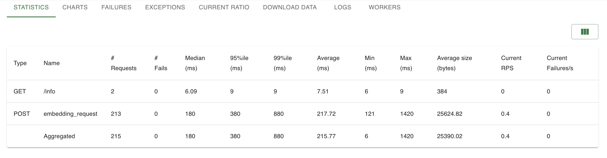
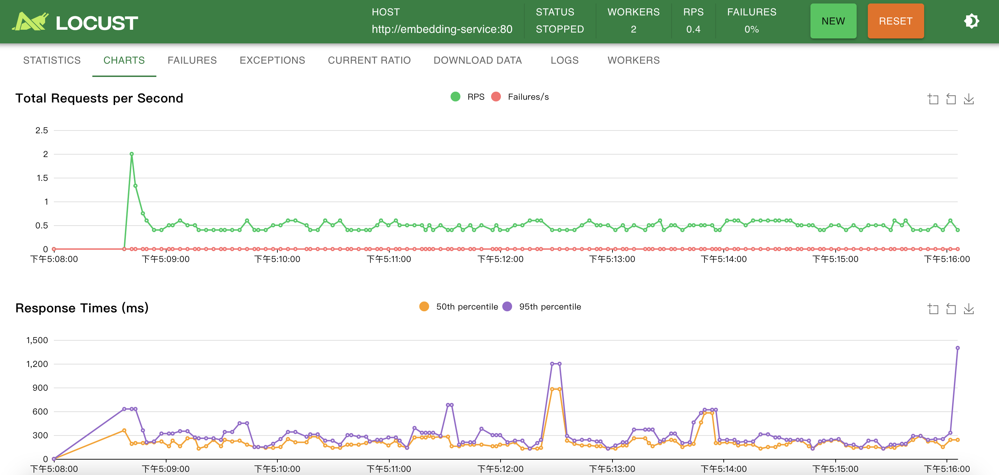

# Locust Load Tester for Text Embeddings

A load testing suite using Locust to benchmark text embedding models, specifically designed for testing HuggingFace's text-embeddings-inference service. This project helps you understand the performance characteristics of your embedding model deployment under various load conditions.





## Features

- Docker-based setup for both the embedding service and load testing infrastructure
- Distributed load testing with Locust master and worker nodes
- Configurable test scenarios and parameters
- Real-time metrics and reporting
- Health checks and proper error handling

## Prerequisites

- Docker and Docker Compose
- Make (optional, but recommended)
- Curl (for health checks and testing)

## Quick Start

1. Clone the repository:
```bash
git clone https://github.com/jeff52415/locust-load-tester
cd locust-load-tester
```

2. Start the services:
```bash
make up
```

3. Access the Locust web interface at http://localhost:8089

4. Start a test with your desired parameters:
   - Number of users
   - Spawn rate (users per second)
   - Host: http://embedding-service:80 (pre-configured)

## Configuration

### Embedding Service Configuration

The embedding service uses the BAAI/bge-m3 model and can be configured in `docker-compose.yml`:

```yaml
command:
  - --model-id
  - "BAAI/bge-m3"
  - --dtype
  - float32
  - --max-concurrent-requests
  - "256"
```

### Load Testing Configuration

Modify `locustfile.py` to adjust:
- Request payload
- Wait time between requests
- Success/failure criteria
- Logging level

## Available Commands

```bash
# Start all services
make up

# Stop all services
make down

# View logs
make logs

# Test single request
make test-single

# Test info endpoint
make test-info

# Clean up
make clean

# Scale workers
make scale WORKERS=4
```

## Monitoring and Metrics

The Locust web interface provides real-time metrics:
- Request per second
- Response times (min, max, average)
- Error rates
- Number of users
- Failure details

## Best Practices

1. Start with a small number of users and gradually increase
2. Monitor response times and error rates
3. Check the logs for any issues
4. Use the test-single command to verify basic functionality
5. Allow the embedding service to warm up before starting tests

## Troubleshooting

1. If requests stop suddenly:
   - Check the logs: `make logs`
   - Verify embedding service health: `make test-info`
   - Ensure sufficient system resources

2. If response times are high:
   - Reduce concurrent users
   - Check system resource usage
   - Consider adjusting model parameters

## Contributing

Contributions are welcome! Please feel free to submit a Pull Request.

## License

MIT License